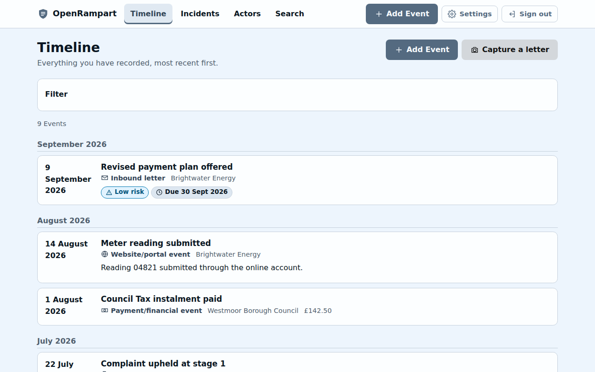
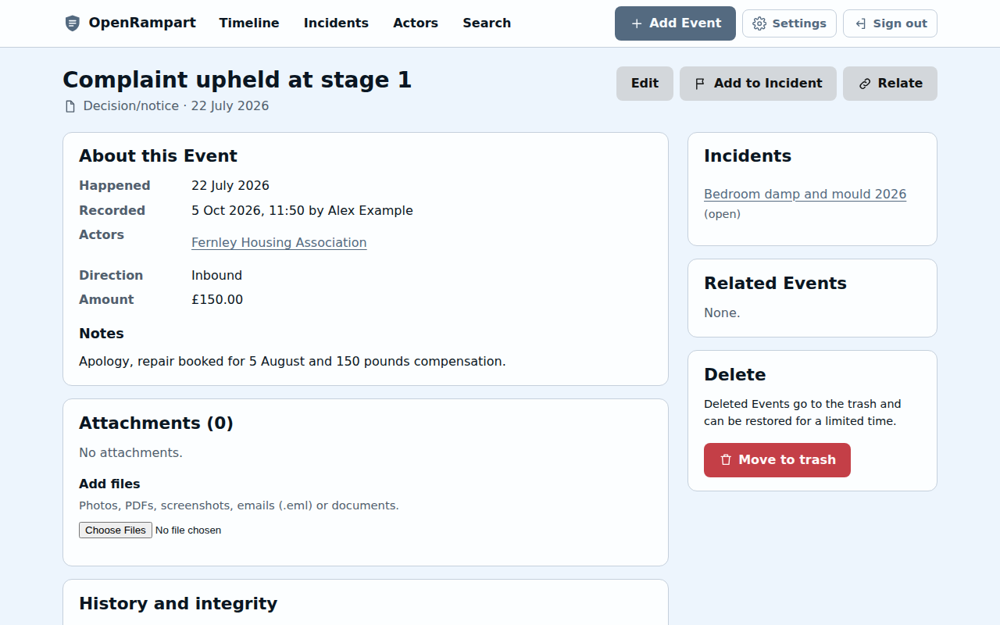
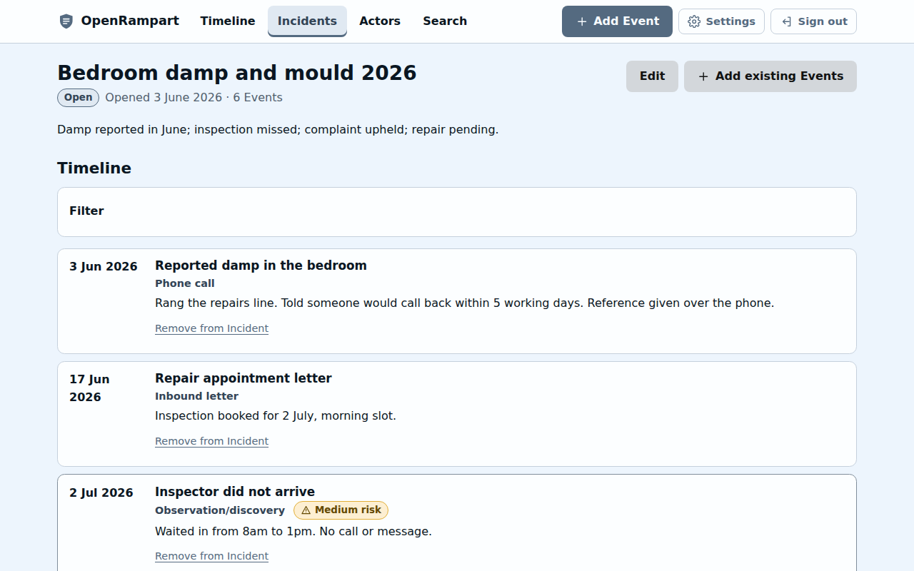

# OpenRampart

**Institutions keep detailed records. OpenRampart gives you your own.**

OpenRampart is an open-source, self-hosted, personal administrative event log. Use it to keep
a durable, searchable record of your dealings with organisations, institutions and people:
letters, phone calls, emails, portal messages, decisions, payments and anything else worth
remembering. Every entry keeps its history. Original documents are stored unchanged, and you
can export everything in ordinary formats at any time.

It is built for anyone who ever needs to say "this is what happened, and when". That might be
a benefits claim, a housing repair, a complaint, a debt, a dispute with an employer or a
healthcare journey. It is also built for the people who help them.

<picture>
  
</picture>

<p>
  
  
</p>

<sub>Screenshots use made-up data. Regenerate them with <code>npm run build && npm run screenshots</code>.</sub>

---

## What it does

- **Events** are the core of the record. An Event is something that happened at a point in
  time: a letter, call, email, visit, payment, decision or note. Events can be incomplete, so
  record what you know now and add detail later.
- **Actors** are the organisations and people involved. Every Actor has their own timeline.
- **Incidents** are optional groupings of related Events, such as "Housing disrepair 2026".
- **Timeline** shows everything newest-first. You can filter by Actor, type, Incident, date
  range, risk level and attachments.
- **Phone letter capture** lets you photograph a multi-page letter in seconds. Originals are
  stored byte-for-byte. Text is recognised in the background with Tesseract and OCRmyPDF, and
  you can correct it. Suggested dates, references and Actors are offered for you to accept;
  they are never applied automatically.
- **Search** covers Events, Actors, Incidents and document text, using PostgreSQL full-text
  search with typo-tolerant suggestions. Search never reveals anything the viewer cannot
  access.
- **Integrity:**
  - Every attachment has a SHA-256 hash.
  - Every change to an Event creates a new, hash-chained revision (RFC 8785 canonical JSON).
  - Hashes can optionally be timestamped with OpenTimestamps.
  - Nothing is silently modified.
- **Helpers** let you invite a trusted person, such as an advocate, family member or support
  worker. You choose exactly what they can see: everything, chosen Actors or chosen
  Incidents, optionally limited to a date range. You also choose whether they can add
  entries or export. Access is enforced on the server and can be ended at any time.
- **AI assistants (optional)** can connect through a remote **MCP server** using OAuth 2.1
  with granular, consent-screen-approved scopes. Reading attachment contents is a separate
  permission. Nothing in OpenRampart requires AI.
- **Audit log** records sign-ins, sharing, exports and assistant access, separately from your
  timeline.
- **Export** produces a ZIP of JSON, Markdown, original files, OCR text, hashes and
  timestamp proofs. It is readable without OpenRampart.
- **Accessible:** designed for WCAG 2.2 AA, tested with axe, and keyboard and screen-reader
  friendly. It is a responsive PWA for phones, with light and dark themes using the "Rain &
  Wind On Rathlin" palette.
- **Private by design:** no analytics, no telemetry, no third-party scripts. See
  [docs/privacy.md](docs/privacy.md).

## Quick start (Docker Compose)

You need Docker with Compose v2, a domain name with HTTPS (or `http://localhost` for a trial)
and S3-compatible object storage. Storage can be the bundled SeaweedFS service or an external
provider such as Cloudflare R2, Backblaze B2 or Hetzner.

```sh
git clone https://github.com/dynumo/OpenRampart.git
cd OpenRampart
cp .env.example .env
# Edit .env: APP_URL, POSTGRES_PASSWORD, SESSION_SECRET, ENCRYPTION_KEY, S3_*.
#   openssl rand -base64 48   # SESSION_SECRET
#   openssl rand -base64 32   # ENCRYPTION_KEY
docker compose up -d --build
```

To try it with the bundled storage, set the following in `.env`:

```sh
COMPOSE_PROFILES=bundled-s3
S3_ENDPOINT=http://s3:8333
S3_FORCE_PATH_STYLE=true
S3_CREATE_BUCKET=true
S3_BUCKET=openrampart
S3_ACCESS_KEY_ID=<any name>
S3_SECRET_ACCESS_KEY=<a long random string>
```

Put a reverse proxy that terminates HTTPS in front of the `app` service on port 3000, then
open `APP_URL`. The first account registered becomes the administrator. You will be asked to
set up an authenticator app and to save recovery codes.

- **Dokploy:** see [docs/dokploy.md](docs/dokploy.md).
- **Other hosts:** see [docs/docker.md](docs/docker.md).
- **Every setting:** see [docs/configuration.md](docs/configuration.md).

## Development

```sh
npm ci
docker compose -f docker-compose.dev.yml up -d   # PostgreSQL + SeaweedFS S3
cp .env.example .env                             # then use the "Local development" block
npm run dev                                      # http://localhost:3000
```

OCR needs `tesseract`, `ocrmypdf`, `pdftotext`/`pdftoppm` (Poppler) and `heif-convert`
(libheif) on your `PATH`. OpenRampart runs without them and reports what is missing under
**Settings → System settings**.

| Command                                       | What it does                                                                                   |
| --------------------------------------------- | ---------------------------------------------------------------------------------------------- |
| `npm run dev`                                 | Server (auto-reload) and Vite dev server                                                       |
| `npm run build`                               | Production build into `dist/`                                                                  |
| `npm test`                                    | Unit and integration tests (needs PostgreSQL and S3 from dev compose)                          |
| `npm run test:e2e`                            | Playwright end-to-end and axe accessibility tests (after `npm run build`)                      |
| `npm run screenshots`                         | Regenerate the README screenshots in `docs/images` from made-up data (after `npm run build`)   |
| `npm run typecheck` / `lint` / `format:check` | Static checks                                                                                  |
| `npm run admin -- <command>`                  | Operator CLI (create-admin, reset-password, reset-totp, disable, enable, migrate, maintenance) |

See [CONTRIBUTING.md](CONTRIBUTING.md).

## Documentation

| Topic                       | Document                                                             |
| --------------------------- | -------------------------------------------------------------------- |
| Architecture                | [docs/architecture.md](docs/architecture.md)                         |
| Security model              | [docs/security-model.md](docs/security-model.md)                     |
| Threat model                | [docs/threat-model.md](docs/threat-model.md)                         |
| Helper permissions          | [docs/authorisation.md](docs/authorisation.md)                       |
| Accounts and sign-in        | [docs/authentication.md](docs/authentication.md)                     |
| Attachments, storage, OCR   | [docs/attachments.md](docs/attachments.md)                           |
| Timestamping                | [docs/timestamping.md](docs/timestamping.md)                         |
| OAuth 2.1                   | [docs/oauth.md](docs/oauth.md)                                       |
| MCP server                  | [docs/mcp.md](docs/mcp.md)                                           |
| Export format               | [docs/export-format.md](docs/export-format.md)                       |
| Configuration               | [docs/configuration.md](docs/configuration.md)                       |
| Docker / Dokploy            | [docs/docker.md](docs/docker.md), [docs/dokploy.md](docs/dokploy.md) |
| Object storage              | [docs/object-storage.md](docs/object-storage.md)                     |
| Email (Elastic Email, SMTP) | [docs/email.md](docs/email.md)                                       |
| Migrations                  | [docs/migrations.md](docs/migrations.md)                             |
| Backup and restore          | [docs/backup-restore.md](docs/backup-restore.md)                     |
| Accessibility               | [docs/accessibility.md](docs/accessibility.md)                       |
| Privacy                     | [docs/privacy.md](docs/privacy.md)                                   |
| Licensing                   | [LICENSING.md](LICENSING.md)                                         |
| Reporting vulnerabilities   | [SECURITY.md](SECURITY.md)                                           |

## What OpenRampart is not

It is not a case-management system for organisations, a document editor, a legal-advice
tool or a social network. It does not decide anything for you. A timestamp shows that a
record existed at a time; it does not prove the record is true. It is your record, kept
carefully.

## Licence

OpenRampart is currently released under the [MIT Licence](LICENSE). The project owner is
considering the long-term licence; see [LICENSING.md](LICENSING.md) for the trade-offs.
